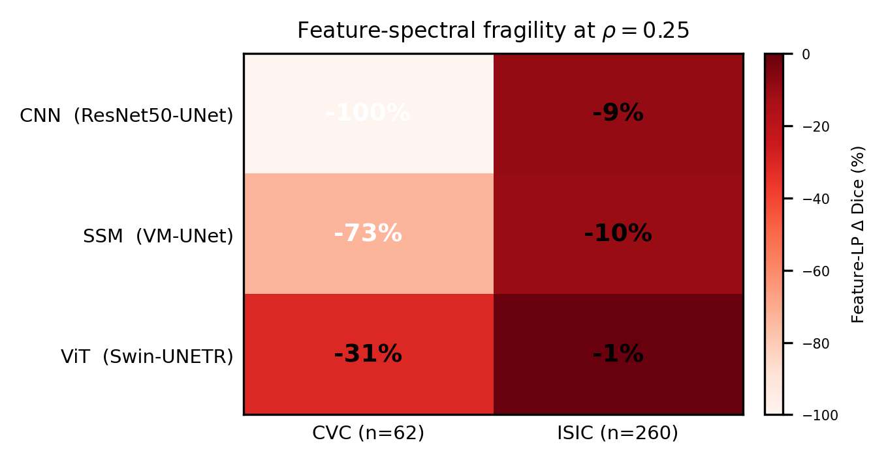
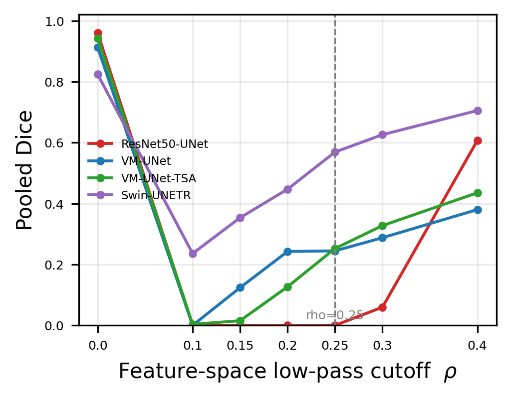
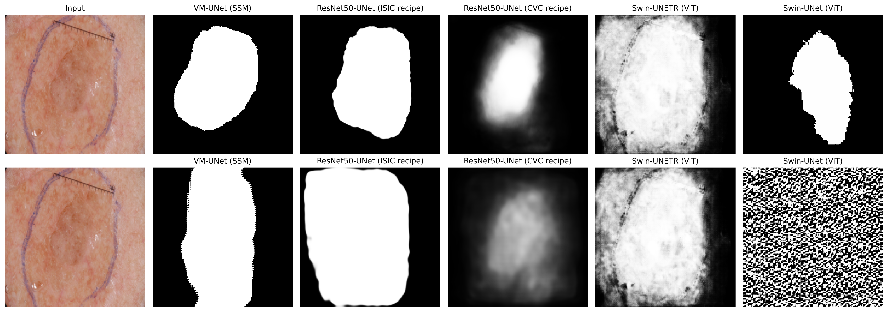

# CausalMamba

## Feature-Domain Spectral Fragility is Dataset-Dependent

### A Cross-Dataset Causal Analysis of CNN, SSM, and ViT Segmenters

Submitted to IEEE International Symposium on Biomedical Imaging (ISBI) 2027

Subhash Kashyap

Python PyTorch MONAI CVC-ClinicDB ISIC2018 Bootstrap-CI

---

## TL;DR

The prevailing intuition in medical segmentation is that architecture family determines
robustness: transformers are assumed to behave like transformers, CNNs like CNNs. This
project tests that assumption directly by causally intervening on the internal feature
representations of three segmentation architectures, a CNN, a state-space model (SSM),
and a vision transformer, and surgically removing high-frequency content from every
semantic block via an FFT low-pass mask, post-training, with no parameters changed.

The empirical results collapse the architecture-family intuition entirely. On
CVC-ClinicDB, the same intervention that leaves the transformer nearly untouched
completely destroys the CNN (Dice 0.960 to 0.000) and heavily degrades the SSM
(-73.2%). On ISIC2018, the identical protocol on the identical architectures barely
moves any of them. The fragility ordering CNN > SSM > ViT holds on both datasets, but
the magnitude of that fragility is a property of the dataset, not the architecture, and
this dataset-dependence is itself statistically resolvable via two-sample bootstrap
confidence intervals on the cross-dataset difference, not merely visually obvious. A
second experiment shows the danger of trusting architecture-family labels at all: two
different transformers trained on identical ISIC data differ by 66 percentage points
in feature-space robustness.

---

## Key Results at a Glance

**Cross-dataset feature-spectral fragility at rho=0.25 (Delta% Dice, held-out test splits):**

| Architecture | CVC (n=62) clean->LP | ISIC (n=260) clean->LP | Leg |
|---|---:|---:|---|
| ResNet50-UNet (CNN) | 0.960->0.000 (**-100%**) | 0.892->0.808 (-9.4%) | matched recipe |
| VM-UNet (SSM) | 0.912->0.244 (**-73.2%**) | 0.915->0.821 (-10.3%)+ | CVC canonical; ISIC legacy VSSM |
| Swin-UNETR (ViT) | 0.824->0.569 (-30.9%) | 0.890->0.884 (**-0.6%**) | matched recipe |

+ ISIC SSM leg uses a legacy VSSM implementation rather than the canonical vectorized
one used for CVC, verified to agree to 0.906 mean feature similarity (6/30 VSSBlocks
differ). See Limitations.



| Finding | Value |
|---|---|
| Fragility multiplier, CVC vs ISIC | CNN 10.6x, SSM 7.1x, ViT 52x |
| Per-image significance | Wilcoxon p < 1e-18 to p < 1e-19 (every model, both datasets) |
| Cross-dataset difference, 2-sample bootstrap 95% CI | CNN [0.799, 0.841], SSM [0.543, 0.668], ViT [0.237, 0.355] |
| Swin-UNETR (matched) vs Swin-UNet (unmatched) on ISIC | -0.6% vs -66.5% |
| Input-domain LP degradation (CVC, rho=0.25) | CNN -20.0%, SSM -6.2%, ViT -0.8% |
| TSA (Fourier augmentation defense) input-LP repair | 0.856->0.931 pooled Dice |
| TSA feature-domain collapse (unrepaired) | -73.2%, identical to the un-augmented SSM |
| SSM boundary F1 / HD95, clean->feature-LP | 0.719->0.069 / 18.9->98.2 px |
| ViT boundary F1 / HD95, clean->feature-LP | 0.497->0.180 / 51.3->87.4 px |
| CNN feature-LP predictions | entirely empty (BF1 0.000, HD95 undefined) |

---

## Table of Contents

- [Motivation and Background](#motivation-and-background)
- [Theoretical Framework and Mathematical Derivations](#theoretical-framework-and-mathematical-derivations)
- [Architecture and Validation Pipeline](#architecture-and-validation-pipeline)
- [Quantitative Results](#quantitative-results)
- [Robustness Evaluation](#robustness-evaluation)
- [Spatial and Qualitative Analysis](#spatial-and-qualitative-analysis)
- [Repository Structure](#repository-structure)
- [Reproducibility](#reproducibility)
- [Discussion and Limitations](#discussion-and-limitations)
- [Citation](#citation)
- [License](#license)

---

## Motivation and Background

Segmentation robustness is almost universally studied at the input level: noise, blur,
compression, domain shift. What is rarely tested is whether a trained model's internal
feature representations carry the same fragility as its input pixels do, and whether
that fragility is even a property of the architecture at all, or something the
architecture happened to learn from a specific dataset.

This is not an academic distinction. If fragility is architectural, a practitioner
deploying a known-robust architecture family (say, transformers) can reasonably expect
that robustness to transfer to a new clinical dataset. If fragility is dataset-learned,
that assumption is dangerous: an architecture that appeared robust on one imaging
modality could collapse silently on another, with no warning visible from clean-data
performance alone.

State-space models (Mamba, VM-UNet) and vision transformers are essentially unstudied
under feature-frequency intervention, and existing cross-architecture comparisons are
routinely confounded by recipe differences (different initialization, loss, schedule,
or resolution per architecture), making any "architecture X is more robust" claim
impossible to trust at face value. This project closes both gaps: it intervenes on
internal feature frequency content directly, and it holds training recipe fixed across
architectures and datasets wherever possible, with every remaining mismatch disclosed
rather than hidden.

---

## Theoretical Framework and Mathematical Derivations

### The Feature-Domain Low-Pass Intervention

For a feature tensor f^(l) extracted at semantic block l of a trained network, the
intervention computes the 2-D discrete Fourier transform, applies an ideal circular
low-pass mask M_rho at normalized radial cutoff rho, and inverts:

```
f_tilde^(l) = IFFT( M_rho . FFT( f^(l) ) )
```

where M_rho(u, v) = 1 if sqrt(u^2 + v^2) <= rho * r_max and 0 otherwise, with r_max the
maximum representable radial frequency for the tensor's spatial dimensions. This is
applied via forward hooks registered on **every** semantic block of the network, not a
single layer, so the intervention is architecture-wide: 9 encoder/decoder blocks for
the CNN, 30 VSSBlocks for the SSM, 8 transformer blocks for the ViT. The headline
cutoff throughout is rho = 0.25; a full dose-response sweep is run at
rho in {0.10, 0.15, 0.20, 0.25, 0.30, 0.40}.

Critically, the intervention is applied **post-training**: no parameters are updated
and no gradient flows through the mask. Any change in segmentation output is therefore
attributable strictly to the removed frequency content, not to any learning effect.

### Input-Domain Dissociation

To test whether feature-domain fragility is simply a downstream consequence of
input-level frequency sensitivity, the identical mask is separately applied to the
resized input image before the forward pass (no hooks), producing a matched
input-domain low-pass condition at the same rho for direct comparison.

### DeltaDice and Statistical Testing

Degradation is defined as:

```
DeltaDice = Dice_clean - Dice_intervened
```

so positive values indicate degradation. Per-image significance is assessed with
paired Wilcoxon signed-rank tests. Point estimates carry standard bootstrap 95%
confidence intervals (10,000 resamples).

### Testing the Dataset-Dependence Claim Directly

The headline claim, that fragility magnitude depends on dataset rather than
architecture alone, is not left as a visual inference from two side-by-side numbers.
It is tested directly with a **two-sample bootstrap** on the difference in mean
DeltaDice between datasets, per architecture:

```
Delta_hat = mean(DeltaDice_CVC) - mean(DeltaDice_ISIC)
```

with Delta_hat's 95% CI computed by independently resampling each dataset's per-image
DeltaDice array with replacement 10,000 times. All three architectures' CIs exclude
zero, confirming the dataset-dependence is statistically resolvable, not merely
descriptive.

---

## Architecture and Validation Pipeline

Three architecture families, trained with matched recipes wherever both datasets
allow it:

- **CNN**: ResNet50-UNet, random encoder init, BCEWithLogits, Adam lr=1e-4,
  CosineAnnealing(100), 256px, batch 8, seed 42. Identical recipe on both datasets;
  only input normalization differs (ImageNet stats for ISIC, [0,1] for CVC).
- **SSM**: VM-UNet, 30 VSSBlocks (depths [2,2,9,2]), AdamW 1e-4, BCE+soft-Dice, cosine,
  100 epochs. CVC uses the canonical vectorized selective-scan VSSM implementation.
  ISIC uses a legacy per-timestep implementation, disclosed and measured (0.906 mean
  feature similarity, 6/30 blocks differ) rather than silently substituted.
- **ViT**: Swin-UNETR, spatial_dims=2, BCEWithLogits, Adam 1e-4, cosine, 100 epochs,
  256px, batch 8, seed 42. Identical recipe on both datasets.
- **Defense baseline**: VM-UNet-TSA, the CVC SSM fine-tuned with input-space Fourier
  low-pass augmentation, used only to test whether input-domain spectral robustness
  transfers to the feature domain (it does not).
- **Secondary comparison**: Swin-UNet, a differently-trained, unmatched transformer
  checkpoint, included specifically to test whether fragility conclusions generalize
  within the "transformer" label (they do not).

All held-out evaluation uses deterministic seed-42 splits: CVC-ClinicDB carved
489/61/62 (train/val/test), ISIC2018 carved 2075/259/260. Model selection uses the
val splits only; every headline number in the paper is reported on the untouched test
splits.

---

## Quantitative Results

**Table 1 -- CVC feature-space low-pass dose-response (pooled Dice, n=62 held-out test):**

| Model | Clean | rho=0.10 | 0.15 | 0.20 | 0.25 | 0.30 | 0.40 |
|---|---:|---:|---:|---:|---:|---:|---:|
| ResNet50-UNet (CNN) | 0.960 | 0.000 | 0.000 | 0.000 | 0.000 | 0.060 | 0.607 |
| VM-UNet (SSM) | 0.912 | 0.000 | 0.124 | 0.243 | 0.244 | 0.288 | 0.380 |
| VM-UNet-TSA | 0.942 | 0.004 | 0.015 | 0.127 | 0.252 | 0.327 | 0.435 |
| Swin-UNETR (ViT) | 0.824 | 0.236 | 0.353 | 0.447 | 0.569 | 0.626 | 0.705 |



**Table 2 -- Cross-dataset feature-spectral fragility at rho=0.25 (Delta% Dice, held-out test splits):**

| Architecture | CVC (n=62) clean->LP (Delta%) | ISIC (n=260) clean->LP (Delta%) | Leg |
|---|---:|---:|---|
| ResNet50-UNet (CNN) | 0.960->0.000 (-100%) | 0.892->0.808 (-9.4%) | matched recipe |
| VM-UNet (SSM) | 0.912->0.244 (-73.2%)+ | 0.915->0.821 (-10.3%)+ | CVC canonical; ISIC legacy VSSM |
| Swin-UNETR (ViT) | 0.824->0.569 (-30.9%) | 0.890->0.884 (-0.6%) | matched recipe |

+ ISIC SSM uses the legacy VSSM implementation, not the canonical implementation used
for CVC (0.906 mean feature similarity between the two).

The core reading: feature-spectral fragility is **consistently ordered CNN > SSM > ViT
on both datasets**, and every family is far more fragile on CVC than on ISIC (CNN
10.6x, SSM 7.1x, ViT 52x). This is not a spurious artifact of small effect sizes;
every per-image effect is significant at p < 1e-18 or smaller, and the cross-dataset
difference itself is significant for every architecture via the two-sample bootstrap
described above.

A secondary result closes an obvious escape hatch in any "architecture family"
framing: the same ISIC data and protocol that leaves the matched Swin-UNETR
essentially immune (-0.6%) collapses a different, unmatched transformer checkpoint,
Swin-UNet, by -66.5%. Robustness claims that name only the architecture family, not
the exact architecture, are not trustworthy.

---

## Robustness Evaluation

**Table 3 -- Input-domain dissociation and defense (CVC, rho=0.25, n=62 held-out test):**

| Model | Clean | Input-LP | Feat-LP | Delta% feat | BF1 clean->LP | HD95 clean->LP |
|---|---:|---:|---:|---:|---:|---:|
| ResNet50-UNet (CNN) | 0.960 | 0.768 | 0.000 | -100% | 0.892->0.000 | 8.1->n/a* |
| VM-UNet (SSM) | 0.912 | 0.856 | 0.244 | -73.2% | 0.719->0.069 | 18.9->98.2 |
| VM-UNet-TSA | 0.942 | 0.931 | 0.252 | -73.2% | 0.807->0.076 | 16.0->90.7 |
| Swin-UNETR (ViT) | 0.824 | 0.817 | 0.569 | -30.9% | 0.497->0.180 | 51.3->87.4 |

\* HD95 is undefined when predictions are empty.

**Input-domain vs. feature-domain dissociation.** Applying the identical low-pass mask
to the resized input rather than internal features degrades all models far less (CNN
worst at -20.0% vs. -100% in feature-space; SSM -6.2% vs. -73.2%; ViT -0.8% vs.
-30.9%). Feature-domain fragility is not a trivial downstream consequence of
input-level frequency sensitivity.

**Defense generalization failure.** VM-UNet-TSA, fine-tuned specifically with
input-space Fourier low-pass augmentation, successfully improves input-domain
robustness (pooled Dice 0.856->0.931 under input-LP). It has **no effect** on the
feature-domain collapse: both the un-augmented SSM and TSA collapse to an identical
-73.2% under feature-space intervention. Spectral robustness learned at the input
level does not transfer to the feature level.

---

## Spatial and Qualitative Analysis

**Dose-response.** All architectures degrade sharply under feature-space low-pass
filtering, but their onset and recovery profiles differ substantially across the
rho in {0.10, ..., 0.40} sweep (Table 1, Fig. 1 above). The CNN collapses almost
immediately and stays collapsed through rho = 0.30; the SSM plateaus in the
mid-range; the ViT degrades gradually and is the most resilient at every cutoff on
CVC.

**Boundary metrics.** Feature-domain low-pass destroys boundary structure wherever it
is effective (Table 3): the SSM's boundary F1 falls from 0.719 to 0.069 and HD95
rises from 18.9 to 98.2 px; the ViT degrades 0.497->0.180 BF1. The CNN's feature-LP
predictions are entirely empty; HD95 is undefined by construction.

**Qualitative examples.** The figure below shows side-by-side clean vs. feature-LP
predictions on a held-out ISIC image across all five evaluated ISIC checkpoints. The
contrast between the matched Swin-UNETR (visually unchanged) and Swin-UNet
(degenerates to noise) on identical input data is the clearest single visual argument
in the paper for architecture-specificity over family-level claims.



---

## Repository Structure

```
CausalMamba/
|-- SpectralMamba/
|   |-- models/vmunet/
|   |   |-- vmunet.py                   # VM-UNet model definition
|   |   `-- vmamba.py                   # Canonical vectorized selective-scan VSSM
|   |-- VM-UNet/
|   |   `-- best-ckpt/                  # Legacy VSSM checkpoints (ISIC SSM, Swin-UNet)
|   |-- train_vmunet_isic18.py          # Legacy-implementation ISIC training
|   |-- train_unet_isic18.py
|   `-- train_swinunet_isic18.py
|
|-- tta_boundary_study/
|   |-- cvc_clinicdb/
|   |   |-- original/                   # CVC-ClinicDB images (612 frames)
|   |   `-- ground_truth/               # CVC-ClinicDB masks
|   |-- checkpoints/                    # CVC CNN, SSM, ViT checkpoints
|   `-- src/
|       |-- datasets/cvc_dataset.py
|       `-- train_cvc_256.py            # CNN CVC training
|
|-- interventions/
|   |-- intervention.py                 # FFT -> mask -> IFFT hook module
|   |-- isic_dataset.py                 # Cached ISIC dataset loader
|   |-- checkpoints/                    # ISIC CVC-recipe retrained checkpoints (CNN, ViT)
|   |
|   |-- train_vmunet_cvc.py             # SSM CVC training (canonical VSSM)
|   |-- train_vmunet_cvc_tsa.py         # SSM CVC-TSA defense fine-tune
|   |-- train_swinunetr_cvc_256.py      # ViT CVC training
|   |-- train_unet_isic18_cvcrecipe.py  # CNN ISIC retrain, CVC-matched recipe
|   |-- train_swinunetr_isic18_cvcrecipe.py  # ViT ISIC retrain, CVC-matched recipe
|   |-- train_vmunet_isic18_cvcrecipe.py     # SSM ISIC retrain, CVC-matched recipe
|   |
|   |-- experiments/
|   |   |-- carve_splits.py                  # Deterministic seed-42 splits
|   |   |-- eval_cvc_heldout_full.py         # CVC dose sweep + boundary (Tables 1, 3)
|   |   |-- eval_isic_heldout.py             # ISIC held-out eval, all models (Table 2)
|   |   |-- bootstrap_cvc_isic_ci.py         # Cross-dataset difference bootstrap CI
|   |   |-- audit_isbi_numbers.py            # Verifies paper numbers vs. source JSONs
|   |   `-- export_isbi_package.py           # Generates paper tables + figures
|   |
|   `-- results/
|       |-- splits/{cvc_split,isic_split}.json
|       |-- best-vmunet-cvc-tsa-finetune/    # TSA checkpoint
|       |-- best-swinunetr-cvc-256/          # ViT CVC checkpoint
|       `-- paper_v2/
|           |-- tables/                      # table1/2/3 CSVs
|           `-- figures/                     # fig1/2/3 300dpi PNGs (embedded above)
|
|-- scripts/                            # Misc. utility scripts
`-- .gitignore
```

---

## Reproducibility

### Environment Setup

```bash
git clone https://github.com/Subkash2206/CausalMamba
cd CausalMamba
pip install -r requirements.txt
```

### Dataset Placement

```
tta_boundary_study/cvc_clinicdb/
|-- original/           # CVC-ClinicDB images
`-- ground_truth/       # CVC-ClinicDB masks

SpectralMamba/VM-UNet/data/isic18/train/
|-- images/             # ISIC2018 images
`-- masks/              # ISIC2018 masks
```

Both datasets are public: CVC-ClinicDB (Bernal et al., 2015),
https://doi.org/10.1016/j.compmedimag.2015.02.007
ISIC2018 (Codella et al., 2019), https://arxiv.org/abs/1902.03368

### Full Pipeline Execution

```bash
# 1. Carve the deterministic seed-42 splits
python interventions/experiments/carve_splits.py

# 2. Train each architecture (matched recipe, seed 42)
python interventions/train_vmunet_cvc.py --img_size 352 --epochs 100 --batch_size 8 --amp --checkpointing --seed 42 --output_dir tta_boundary_study/checkpoints
python interventions/train_vmunet_cvc_tsa.py --img_size 352 --epochs 100 --batch_size 4 --amp --checkpointing --seed 42 --output_dir interventions/results
python interventions/train_swinunetr_cvc_256.py --img_size 256 --epochs 100 --batch_size 8 --lr 1e-4 --seed 42 --output_dir interventions/results
python tta_boundary_study/src/train_cvc_256.py                                    # CNN, CVC
python interventions/train_unet_isic18_cvcrecipe.py                               # CNN, ISIC, matched recipe
python interventions/train_swinunetr_isic18_cvcrecipe.py                          # ViT, ISIC, matched recipe
python interventions/train_vmunet_isic18_cvcrecipe.py                             # SSM, ISIC, matched recipe (optional -- see Limitations)
python SpectralMamba/train_vmunet_isic18.py                                       # SSM, ISIC, legacy VSSM (used in the paper's ISIC SSM leg)

# 3. Held-out evaluation
python interventions/experiments/eval_cvc_heldout_full.py --output_json interventions/results/cvc_heldout_full.json
python interventions/experiments/eval_isic_heldout.py --models all --output_json interventions/results/isic_heldout_eval.json

# 4. Cross-dataset statistical test (no args)
python interventions/experiments/bootstrap_cvc_isic_ci.py

# 5. Export all paper tables (CSV) and figures (300 dpi PNG)
python interventions/experiments/export_isbi_package.py

# 6. Verify every number in the paper draft matches its source JSON (no args)
python interventions/experiments/audit_isbi_numbers.py
```

To regenerate only the paper's tables and figures from the **existing** result JSONs
(no retraining, no re-evaluation), steps 5 and 6 alone are sufficient.

---

## Discussion and Limitations

Feature-spectral fragility is dataset-dependent and architecture-specific, not an
invariant of a model family. Recipe-matched, held-out evaluation replaces a naive
architecture-family intuition with a stable, statistically-resolvable, interpretable
ordering, and warns that robustness claims must specify the exact architecture, not
the family. The following limitations are disclosed directly rather than minimized:

- **ISIC SSM implementation mismatch.** The ISIC SSM leg uses a legacy per-timestep
  VSSM implementation rather than the canonical vectorized one used for CVC. The two
  implementations were verified to agree to 0.906 mean feature similarity (6/30
  VSSBlocks differ). The canonical retrain is scripted and ready
  (`train_vmunet_isic18_cvcrecipe.py`) but was not completed for this submission due
  to compute constraints; see `KAGGLE_RUNBOOK.md` / `CLOUD_RETRAIN.md`.
- **Split provenance for one sub-analysis.** The CVC boundary-locus band-error and
  lesion-size analyses reflect an earlier 123-image CVC validation split, not the
  held-out test split used everywhere else in the paper.
- **Unmatched secondary comparison.** The Swin-UNETR vs. Swin-UNet comparison uses two
  differently-trained transformer checkpoints and cannot isolate architecture as the
  sole cause of the observed 66-point gap.
- **Single training seed.** All results use seed 42 throughout; multi-seed variance is
  not characterized.
- **Dataset-specific normalization.** Input normalization differs by dataset
  (ImageNet statistics for ISIC, [0,1] for CVC), a necessary preprocessing difference
  rather than a recipe mismatch.

---

## License

The source code in this repository is licensed under the MIT License. The
accompanying manuscript and figures are licensed under Creative Commons Attribution
4.0 International (CC-BY 4.0).
